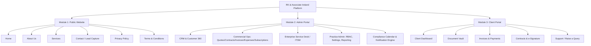
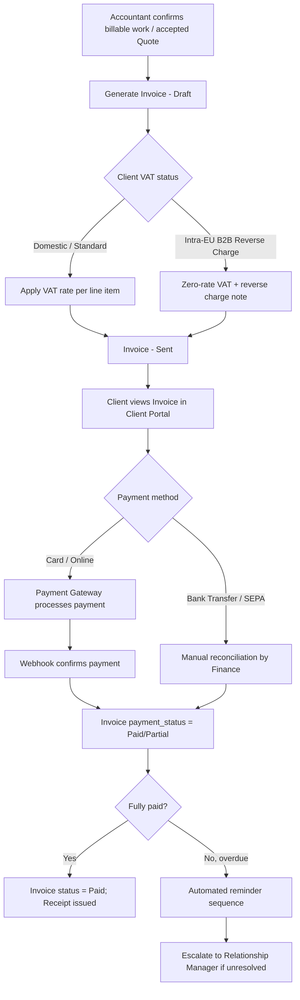
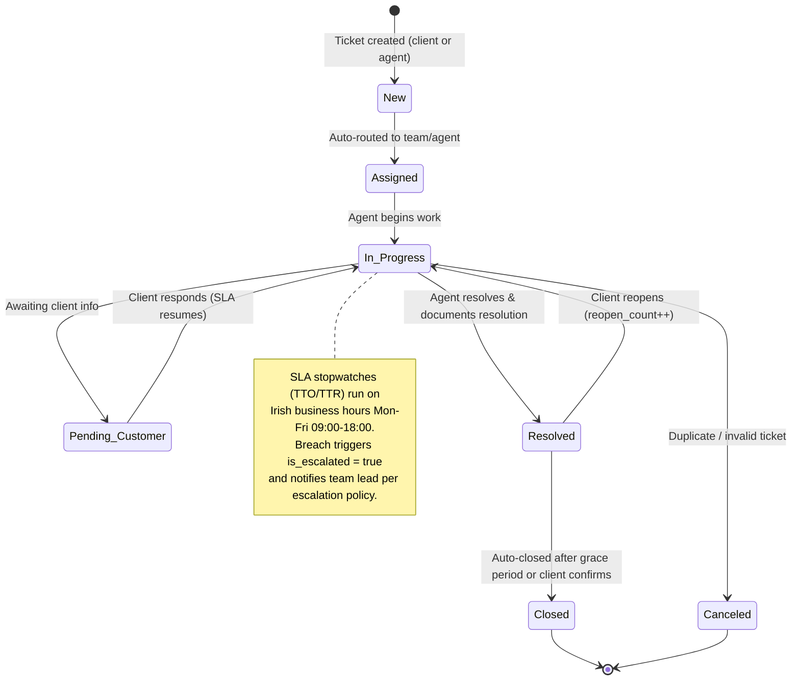
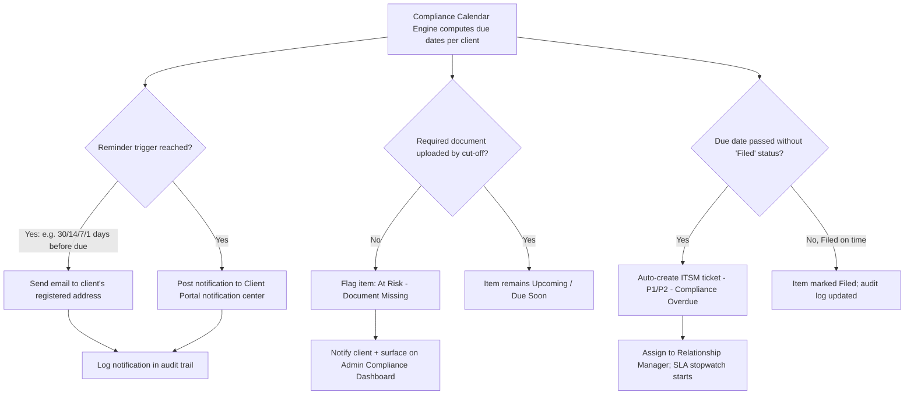
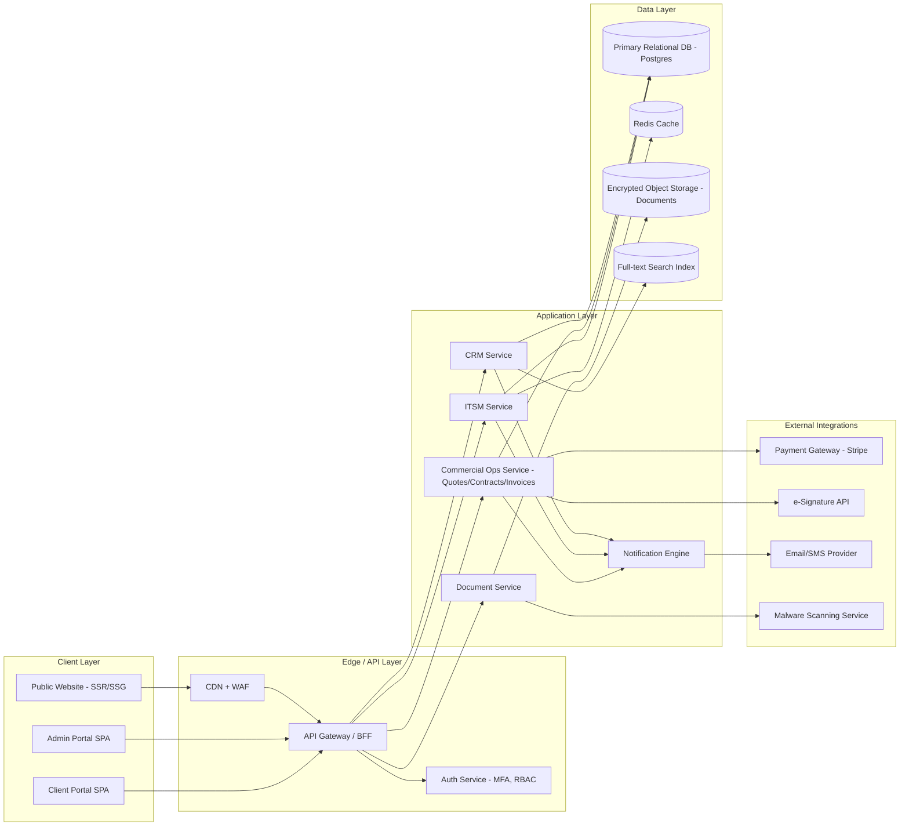
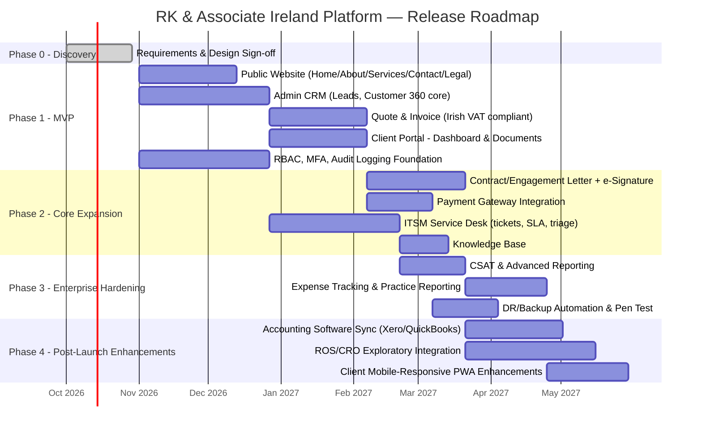

# Product Requirements Document
## RK & Associate Ireland — Digital Client & Practice Management Platform

| | |
|---|---|
| **Document Owner** | Senior Technical Product Manager |
| **Status** | Draft v1.0 — For Stakeholder Review |
| **Date** | 28 September 2026 |
| **Classification** | Internal — Confidential |
| **Reference Architecture** | Operational/ticketing/CRM patterns adapted from `kdadks/kdadks` (`src/`) practice-management codebase |

---

## Table of Contents

1. [Executive Summary & Product Vision](#1-executive-summary--product-vision)
2. [Information Architecture & Core Modules](#2-information-architecture--core-modules)
3. [Detailed Functional Requirements & Workflows](#3-detailed-functional-requirements--workflows)
4. [Non-Functional Requirements & Compliance](#4-non-functional-requirements--compliance)
5. [Technical Stack Recommendations & Integrations](#5-technical-stack-recommendations--integrations)
6. [Implementation Roadmap & Release Phases](#6-implementation-roadmap--release-phases)
7. [Appendices](#7-appendices)

---

## 1. Executive Summary & Product Vision

### 1.1 Business Context

RK & Associate Ireland is a chartered accountancy and business advisory practice serving Irish SMEs, start-ups, and individual taxpayers. Client service today is fragmented across email, spreadsheets, phone calls, and disconnected accounting tools (e.g., Big Red Cloud, Surf, Sage, Xero used client-side). This creates:

- No single source of truth for client status, deadlines, or entity data (Companies Registration Office [CRO] number, Revenue Tax Reference Number, VAT number).
- Manual, error-prone tracking of Revenue Online Service (ROS) filing deadlines (VAT3, P30/PAYE-ERR, CT1, Form 11, iXBRL, RCT), and CRO annual return dates (B1).
- No structured support/query channel — client queries arrive via email/phone with no SLA, ownership, or audit trail.
- Manual, non-compliant invoicing and quote generation without consistent Irish VAT treatment (Reverse Charge, VAT@23%/13.5%/9%/0%, reduced/exempt categories).
- Paper-based or ad hoc engagement letters, with no digital signature or version audit trail (a regulatory requirement under Chartered Accountants Ireland Institute practice standards).
- No unified visibility for practice partners into revenue, client risk, workload, and staff capacity.

### 1.2 Problem Statement

> RK & Associate Ireland needs a unified, secure digital platform that lets Irish SME and individual clients engage with the practice self-service — including document exchange, e-signatures, invoicing, and support — while giving internal staff an enterprise-grade back-office (CRM, commercial operations, and IT/Client Service Desk) to manage the full client lifecycle from lead to engagement to ongoing compliance delivery, with full auditability for regulatory and quality-assurance purposes.

### 1.3 Product Vision

A single, secure digital ecosystem — **Public Website**, **Admin Portal (Practice Back-Office)**, and **Client Portal** — that:

- Converts website visitors into qualified leads and tracked engagements.
- Gives every staff member (Partner, Manager, Accountant, Payroll Officer, Company Secretarial Officer, Support Agent) one system for client data, commercial documents, and support tickets.
- Gives every client one place to see deadlines, upload/download documents, view and pay invoices, sign contracts, and raise/track queries — with the same rigor as an enterprise ITSM service desk.
- Embeds Irish regulatory context (Revenue/ROS, CRO, GDPR, Data Protection Commission [DPC]) natively into data models rather than bolting it on.

### 1.4 Target Audiences / Personas

| Persona | Description | Primary Needs |
|---|---|---|
| **SME Business Owner / Finance Contact** | Directors of Irish limited companies, partnerships, sole traders | Deadline visibility, document upload, invoice payment, support queries |
| **Individual Client** | PAYE workers, landlords, sole traders filing Form 11/12 | Simple onboarding, secure document upload, tax return status |
| **Practice Partner** | Firm owner/partner | Portfolio-level KPIs, revenue, risk, staff workload, WIP |
| **Client Manager / Accountant** | Delivers accounting, tax, VAT, payroll services | Client 360 view, task management, engagement tracking |
| **Payroll Officer** | Runs weekly/monthly payroll for clients | Payroll calendar, employee data, Revenue payroll submission tracking |
| **Company Secretarial Officer** | Manages CRO filings, statutory registers | Entity/CRO tracking, filing deadline automation |
| **Service Desk Agent** | Handles client queries/tickets | Ticket queue, SLA countdown, knowledge base |
| **External Auditor / Reviewer** | Quality assurance / regulatory reviewer | Read-only audit trail, engagement letter archive, immutable logs |
| **System Administrator** | IT/ops admin | RBAC, integrations, backups, monitoring |

### 1.5 Success Metrics / KPIs

| Category | KPI | Target (Year 1 post-launch) |
|---|---|---|
| Client Adoption | % of active clients registered on Client Portal | ≥ 75% within 6 months |
| Lead Conversion | Website enquiry → qualified lead → signed engagement conversion rate | ≥ 20% |
| Onboarding Speed | Avg. time from lead to signed engagement letter | ≤ 5 business days |
| Compliance | % of ROS/CRO deadlines met with zero late-filing penalty | 100% |
| Service Desk | SLA compliance (Time to Response / Time to Resolution) | ≥ 95% |
| Service Desk | Average CSAT score | ≥ 4.5 / 5 |
| Billing | Invoice-to-cash cycle (avg. days sales outstanding) | ≤ 21 days |
| Billing | % invoices paid online via portal | ≥ 60% |
| Platform | Uptime | ≥ 99.9% |
| Security | Security incidents / data breaches | 0 |
| Staff Efficiency | Reduction in manual admin time per client/year | ≥ 30% |

---

## 2. Information Architecture & Core Modules



### 2.1 Module 1: Public-Facing Website

**Goal:** Establish credibility as a chartered accountancy practice, educate prospects on Irish compliance obligations, and convert visitors into tracked leads inside the Admin CRM.

#### 2.1.1 Home
- Hero section: value proposition ("Chartered Accountants & Business Advisors for Irish SMEs"), primary CTA ("Book a Free Consultation"), secondary CTA ("Get a Quote").
- Trust indicators: Chartered Accountants Ireland membership badge, years in practice, client testimonials, industries served.
- Services snapshot (6 tiles: Accounting, VAT, Payroll, Company Secretarial, Taxation, Advisory) linking to Services deep-dive.
- Insights/News teaser (Revenue deadline reminders, budget updates) — CMS-driven.
- Sticky "Book Consultation" widget and live chat entry point (routes into Service Desk as a `service_request` ticket or Lead).

#### 2.1.2 About Us
- Firm history, mission, and Chartered Accountants Ireland / CPA Ireland regulatory registration details (statutory disclosure).
- Partner/team profiles (photo, qualification, specialism) — sourced from an internal `Team` content type.
- Client industries served, values, community involvement.
- Office location(s), map embed, professional indemnity insurance disclosure (standard practice requirement).

#### 2.1.3 Services (Deep-Dive)
Each service is a dedicated landing page with SEO-optimized structured content, generated from a shared `ServicePage` schema (title, summary, deliverables, FAQ, related insights, CTA):

| Service | Key Content Requirements |
|---|---|
| **Accounting & Bookkeeping** | Statutory financial statements (Companies Act 2014), management accounts, year-end accounts preparation, iXBRL tagging for CRO/Revenue, cloud bookkeeping (Xero/QuickBooks/Big Red Cloud partner badges) |
| **VAT Compliance** | VAT registration thresholds (€42,500 services / €85,000 goods), VAT3 bi-monthly returns, RTD (Return of Trading Details), Reverse Charge (VAT MOSS/OSS for digital services & intra-EU), VIES/Intrastat filing, VAT on property |
| **Payroll** | PAYE/PRSI/USC administration, Revenue Payroll Notifications (RPN), real-time reporting (PAYE Modernisation / RTR submissions), employer registration, benefit-in-kind, statutory sick pay, auto-enrolment pension readiness |
| **Company Secretarial** | Company formation (CRO), annual return (Form B1) and 56-day iXBRL filing window, register of beneficial ownership (RBO), statutory registers, director/secretary changes (B10), share allotments, registered office services |
| **Taxation** | Corporation Tax (CT1, 12.5%/15% rates), Income Tax (Form 11 self-assessed, Form 12 PAYE), Capital Gains Tax, Capital Acquisitions Tax, R&D tax credits, Revenue audits & Revenue Compliance Intervention support, tax clearance certificates |
| **Advisory** | Business planning, cash-flow forecasting, company restructuring, succession planning, grant funding (Enterprise Ireland/Local Enterprise Office), due diligence |

- Each service page includes a **"Request this Service"** CTA that pre-fills a lead-capture form with `service_interest` tagged — feeding directly into Admin CRM lead routing.

#### 2.1.4 Contact
- Multi-field enquiry form: name, company name, email, phone, service interest (multi-select), message, preferred contact time.
- Google reCAPTCHA v3 (or equivalent bot-protection) on all public forms.
- Office address, phone, email, embedded map; "Book a Consultation" calendar-integration option.
- Consent checkbox (explicit GDPR opt-in for marketing communications), linked to Privacy Policy.

#### 2.1.5 Privacy Policy (GDPR)
- Data controller identity and contact details, Data Protection Officer (DPO) contact (if designated).
- Legal basis for processing (contract, legitimate interest, consent, legal obligation under Revenue/CRO reporting).
- Categories of personal data processed (PPS numbers, financial data, payroll/employee data).
- Data retention schedule (aligned to Irish statutory retention: 6 years for tax/accounting records under Section 886 TCA 1997).
- Data subject rights (access, rectification, erasure, portability, objection) and process for exercising them.
- Sub-processors / third-party data recipients (hosting, payment gateway, e-signature provider) and international transfer safeguards (SCCs where applicable).
- Cookie policy cross-reference and breach notification statement (72-hour DPC notification commitment).

#### 2.1.6 Terms & Conditions
- Website usage terms, intellectual property, disclaimer of advice-without-engagement, liability limitations.
- Distinct from **Engagement Letters** (which govern the actual client-service contract terms) — clearly cross-referenced.
- Applicable law (Ireland), dispute resolution, complaints-handling procedure reference (per Chartered Accountants Ireland regulatory requirement).

#### 2.1.7 Lead Capture → Admin CRM Integration
- Every form submission (Contact, Book Consultation, Service Inquiry, Newsletter) creates a `Lead` record via a public API endpoint, **never** direct DB write from the client — enforced through a serverless/edge function with rate limiting and input validation.
- Lead fields: `source` (organic/referral/paid/direct), `service_interest[]`, `utm_campaign`, `consent_marketing`, `assigned_owner` (auto-assigned via round-robin or territory rule), `status` (new → contacted → qualified → converted/lost).
- Automatic email acknowledgment to the prospect + internal Slack/Teams/email notification to the assigned relationship manager.
- Lead-to-Opportunity-to-Quote-to-Engagement pipeline is visible end-to-end inside the CRM (see §2.2.1).

---

### 2.2 Module 2: Admin Portal (Enterprise Back-Office)

The Admin Portal is the practice's operating system, structured around four pillars: **CRM (Customer 360)**, **Commercial Operations**, **Enterprise Service Desk (ITSM)**, and **Practice Administration**.

#### 2.2.1 CRM & Customer 360

A unified customer record aggregating every interaction and financial fact for a client, directly modeled on the reference repository's `Customer360Data` aggregation pattern.

**Client / Entity Profile**
| Field Group | Fields |
|---|---|
| Identity | Client code (auto-generated, e.g. `RKA-2026-0043`), legal entity name, trading name, entity type (Ltd, DAC, Sole Trader, Partnership, LLP, Individual) |
| Irish Regulatory References | **CRO Number**, **Revenue Tax Reference Number (TRN)**, **VAT Registration Number**, **Employer PAYE Registration Number**, **Register of Beneficial Ownership (RBO) status**, ROS Digital Certificate status/expiry |
| Contact | Primary contact, additional authorized contacts (with role: Director/Company Secretary/Bookkeeper), email, phone, registered office address, trading address |
| Commercial | Relationship Manager (assigned staff), service subscriptions active, credit limit, payment terms, engagement status |
| Risk/Compliance | AML/CDD (Customer Due Diligence) status (mandatory for accountancy practices under Irish AML legislation — Criminal Justice (Money Laundering and Terrorist Financing) Act 2010–2021), risk rating (Low/Medium/High), source-of-funds verification, PEP (Politically Exposed Person) screening flag |
| Metadata | Onboarding date, entity status (Active/Dormant/Ceased), assigned partner sign-off |

**360° Aggregated View** (mirrors `Customer360Data`: customer + contacts + leads + opportunities + quotes + contracts + invoices + payments + ITSM tickets + unified timeline):
- **Financial metrics panel**: Total invoiced (lifetime), total collected, outstanding balance, overdue balance, active recurring-service MRR, open quote pipeline value, quote-to-engagement win rate, active contracts count, paid vs. total invoices.
- **Unified activity timeline**: chronological, filterable feed spanning lead creation → opportunity → quote → contract/engagement letter → subscription → invoices → payments → support tickets, each entry tagged by `sourceType` and color-coded badge.
- **Entity/CRO tracker**: upcoming statutory deadlines (Annual Return date, iXBRL filing window, audit exemption status) computed from CRO incorporation date and last filing.
- **Household/Group hierarchy**: cross-entity relationship mapping (e.g., director of multiple companies, related-party groups) — modeled on the reference repo's customer hierarchy/relationship linking.

**Lead & Opportunity Management**
- Kanban and list views: New → Contacted → Qualified → Proposal Sent → Won (Converted) → Lost.
- Auto-assignment rules (round robin, service-line specialism, existing relationship).
- Opportunity value estimation, expected close date, and win-probability tracking feeding practice revenue forecasting.

#### 2.2.2 Commercial Operations

**A. Quote Management**
- Quote builder mirroring the invoice line-item structure: item/service name, description, quantity, unit, unit price, VAT rate, line total, plus **service-based billing** fields (billable hours, resource count) for advisory/consulting engagements.
- Quote lifecycle: `Draft → Sent → Accepted / Rejected → Expired → Converted`.
- Configurable validity period (default 30 days), auto-expiry job.
- One-click **Convert to Engagement/Invoice**, preserving `quote_reference` and `converted_at` traceability.
- Quote PDF generation with firm branding, VAT breakdown, and digital acceptance link (client can accept via Client Portal without needing a full login flow — magic-link acceptance).

**B. Contract / Engagement Letter Management (with e-Signature)**
- Engagement Letter templates by service line (Accounting, Tax, Audit Exemption Accounts, Payroll, Advisory), each built from reusable, version-controlled **template sections** (some `is_locked` for regulatory clauses that cannot be edited by staff — e.g., independence and liability limitation clauses required by Chartered Accountants Ireland).
- Contract types supported: **Engagement Letter**, **Letter of Representation**, **NDA**, **Service Level Agreement**, **Advisory Statement of Work**, **License/Software Agreement**.
- Two-party structure (Party A = RK & Associate Ireland, Party B = Client) capturing legal name, address, CRO number, VAT number for both parties.
- Milestone support for fixed-fee advisory projects (milestone title, deliverables, due date, payment amount, status).
- **E-signature workflow**: Draft → Sent for Signature → Signed by Client → Signed by Firm → Active → (Expired/Terminated/Renewed). Independent `signed_by_party_a` / `signed_by_party_b` boolean flags with signed timestamps, IP address, and signature certificate/audit hash stored as evidence.
- Full **amendment log** (versioned) and **audit trail** (create/edit/status_change/section_edit/delete, with old/new value diff) — mirrors the reference repo's `ContractAuditLog`.
- Renewal reminders (e.g., 60/30/14 days before `expiry_date`).

**C. Invoicing (Irish VAT Compliant)**
- Invoice numbering: configurable prefix/suffix, financial-year-aware sequence, non-reusable sequential numbers (Revenue requirement).
- Mandatory Irish VAT invoice fields: firm's VAT number, client's VAT number (for B2B/reverse charge), invoice date, unique sequential invoice number, description of service, net amount, VAT rate applied per line (23% / 13.5% / 9% / 0% / Exempt / Reverse Charge), VAT amount, gross total, currency (EUR primary, multi-currency supported for international clients).
- Reverse-charge handling for intra-EU B2B services (auto-suppresses VAT amount, prints statutory reverse-charge note).
- Discount support (percentage or fixed), linked Quote reference, and **subscription-driven auto-invoicing** for recurring compliance retainers (monthly bookkeeping, payroll, VAT return fees).
- Invoice status lifecycle: `Draft → Sent → Paid → Overdue → Cancelled`, with separate `payment_status` (`Pending/Partial/Paid`) to support part-payments.
- Payment capture: date, amount, method, reference, reconciliation against invoice; bank details (IBAN/BIC) for domestic and SWIFT/international clients.
- Automated overdue reminders (configurable cadence: 7/14/30 days) and late-payment fee calculation.
- Credit note support and statutory 6-year invoice archival.

**D. Expense Tracking**
- Practice-side expense capture (staff disbursements, third-party filing fees, CRO fees) categorized and optionally re-billed to client as pass-through invoice line items.
- Receipt/attachment upload with OCR-assisted data extraction (optional, Phase 2+).
- Approval workflow (Staff submits → Manager approves → Finance reconciles) with audit trail.
- Reporting: expense by client, by category, by staff member, feeding into practice profitability-per-client analysis.

**E. Subscription Management**
- Recurring service retainer definitions (e.g., Monthly Bookkeeping, Fortnightly/Monthly Payroll, Bi-Monthly VAT Return, Annual Compliance Package) with billing frequency (weekly/monthly/quarterly/bi-monthly/annual), fee amount, VAT treatment, and linked service line.
- Subscription lifecycle: `Active → Paused → Cancelled → Expired`, with start date, renewal date, and next-invoice-due date auto-calculated from billing frequency.
- Auto-invoice generation job that creates and sends the Invoice on the scheduled billing date, referencing `subscription_id` (per the reference repo's subscription-driven invoicing pattern) — eliminates manual re-billing for recurring retainers.
- Upgrade/downgrade/add-on tracking (e.g., adding Payroll to an existing Bookkeeping subscription) with pro-rata adjustment applied to the next invoice.
- Dunning management: automatic pause/flag of a subscription after a configurable number of consecutive failed/overdue payments, with Relationship Manager alert issued before any service suspension.
- Subscription-level reporting: MRR (Monthly Recurring Revenue) by service line, churn rate, upcoming renewals, and at-risk subscriptions (linked to overdue invoices or low CSAT).

**F. Notification & Compliance Deadline Management**
- **Compliance Calendar Engine**: a rules-based calendar that derives each client's upcoming statutory obligations from their entity type, financial year end, VAT registration status, and payroll frequency — covering Irish Revenue/CRO obligations including VAT3 (bi-monthly), RTD (annual), CT1 (Corporation Tax), Form 11/12 (Income Tax), PAYE/PRSI/USC returns, CRO Annual Return (B1) and its 56-day iXBRL filing window, and Register of Beneficial Ownership updates.
- **Admin-configurable notification schedules**: Practice Administrators define one or more lead-time triggers per obligation type (e.g., 30 / 14 / 7 / 1 days before the due date, plus an overdue trigger), each with its own message template — configurable as a firm-wide default and overridable per client or per entity.
- **Dual-channel delivery**: at each trigger point the platform automatically sends a notification to the client's registered email address **and** posts the same notification into the Client Portal notification center, so the reminder remains visible even if the email is missed, with read/unread tracking.
- **Document-linked compliance checks**: each obligation can require specific source documents (e.g., bank statements, payroll timesheets) to be uploaded by a cut-off date; if the required document has not been received, the item is automatically flagged **"At Risk — Document Missing"** in addition to the date-based reminder.
- **Admin Compliance Dashboard**: a firm-wide, filterable view (by client, service line, obligation type, status) showing every obligation as `Upcoming / Due Soon / Overdue / Filed / At Risk (Missing Document)`, colour-coded, with drill-down to the client's record.
- **Automatic escalation to Service Desk**: an obligation that passes its due date without being marked "Filed" automatically opens a `P1_critical` or `P2_high` ITSM ticket (category "Compliance — Overdue Filing") assigned to the client's Relationship Manager, tracked with the same SLA rigor as any other support ticket.
- **Audit trail**: every notification sent (channel, timestamp, recipient, obligation reference) and every manual "mark as filed" action is logged immutably for quality-assurance and Revenue/CRO evidence purposes.

#### 2.2.3 Enterprise Service Desk (ITSM)

Directly adapts the reference repository's ITSM domain model (`ITSMTicket`, `ITSMTicketCategory`, dual SLA stopwatches, CSAT survey, triage desk) to a **Client Query & Practice Support Desk**.

**Ticket Model**
| Field | Description |
|---|---|
| `ticket_number` | Auto-generated, e.g. `INC-20260928-0001` / `SR-20260928-0002` |
| `ticket_type` | `incident` (something broken/wrong, e.g. incorrect payslip), `service_request` (e.g. "please file my VAT return"), `problem` (recurring root-cause issue) |
| `category` | Linked to service line: Accounting Query, VAT Query, Payroll Query, Company Secretarial Request, Tax Query, Advisory Request, Portal/Technical Issue — each category carries its own default SLA hours |
| `priority` | `P1_critical` (e.g., Revenue deadline in <24h, payroll not run), `P2_high`, `P3_medium`, `P4_low` |
| `impact` / `urgency` | `organization / team / user` and `stopped / degraded / inquiry` — used to auto-suggest priority |
| `status` | `new → assigned → in_progress → pending_customer → resolved → closed` (+ `canceled`) |
| `assigned_agent` / `assigned_group` | Individual staff member or team queue (e.g., "Payroll Team") |
| `contract_id` / `subscription_id` | Links ticket to the relevant engagement/retainer for context |

**Dual SLA Stopwatches (adopted from reference repo)**
- **TTO (Time to Own/Response)** and **TTR (Time to Resolution)**, both computed on **Irish business hours (Mon–Fri, 09:00–18:00)**, excluding weekends and Irish public holidays.
- Per-category, per-priority SLA matrix (response hours & resolution hours configurable for P1–P4 independently), e.g.:

| Category Example | P1 Response / Resolution | P4 Response / Resolution |
|---|---|---|
| VAT Query | 1h / 4h | 8h / 48h |
| Payroll Query | 1h / 2h (payroll-day critical) | 8h / 24h |
| Portal/Technical Issue | 2h / 8h | 24h / 72h |

- SLA badges: `green` (on track) / `yellow` (approaching breach) / `red` (breached) / `paused` (awaiting client) / `completed`.
- SLA clock **pauses** automatically when status = `pending_customer` and resumes on client response — preventing unfair breach attribution.
- Automatic escalation flag (`is_escalated`) and internal escalation policy (see §3.2 workflow) when SLA breach is imminent or occurs.

**Routing & Assignment**
- Auto-routing rules based on category → team queue (e.g., all "Payroll Query" tickets route to Payroll Team; overflow/round-robin within team).
- Manual reassignment and **bulk actions**: assign agent, reassign category, override priority, bulk status transition — with mandatory `reason` capture for audit.
- Unassigned-ticket alerting after a configurable idle threshold.

**Collaboration & Audit**
- Comment thread per ticket supporting **internal-only notes** (`is_internal = true`, visible to staff only) vs. **public/client-visible replies**, with @mentions for internal collaboration.
- Attachments with **malware scan status** (`pending / clean / quarantined`) gating client-visible or agent-visible display until scan completes.
- Full **audit log** per ticket (every field change, status transition, assignment change) — immutable, timestamped, actor-attributed — required for quality-assurance and regulatory review by external auditors.
- Reopen tracking (`reopen_count`) to flag recurring/unresolved issues for `problem` escalation.

**Knowledge Base Integration**
- Ticket categories link to a Knowledge Base **Policy/Article** library (e.g., "How to register for ROS", "VAT3 filing checklist").
- Agents can attach/suggest KB articles on ticket resolution (`linked_kb_policy_id`); clients see suggested articles before submitting a new ticket (deflection).
- KB authoring/versioning restricted to Manager+ roles; published articles are searchable from both Admin Portal and Client Portal.

**Triage Desk & Reporting**
- Agent "Triage Desk" dashboard showing: total open, unassigned count, SLA-breached count, SLA-warning count, average CSAT, CSAT survey volume — mirrors the reference repo's `TriageDeskMetrics`.
- Filters: status (all/open/breached), priority, category, assigned agent (all/unassigned/my tickets), client, ticket type, escalated-only.

**CSAT (Customer Satisfaction)**
- On ticket resolution, client is prompted with a 5-question CSAT survey (overall experience, response speed, agent expertise/communication, resolution quality, portal ease-of-use), each rated 1–5 stars plus optional free-text feedback — directly reusing the reference repo's `DEFAULT_CSAT_QUESTIONS` structure.
- Aggregated CSAT feeds practice-level and per-agent performance reporting.

**Separate Login Surfaces**
- **Agent view** (inside Admin Portal, staff authentication + RBAC) vs. **Client view** (inside Client Portal, client authentication) — same underlying ticket store, permission-scoped queries, matching the reference repo's separate `ITSMAgentLogin` / `CustomerPortal` entry points.

#### 2.2.4 Practice Administration
- **RBAC & User Management**: roles (Partner/Admin, Manager, Accountant, Payroll Officer, Company Secretarial Officer, Service Desk Agent, Read-Only Auditor), permission matrix per module/action.
- **Company/Entity Settings**: firm legal details, VAT number, CRO number, logo/branding for documents, bank details, invoice/quote numbering rules.
- **Reporting & Analytics**: revenue by service line, WIP (work-in-progress) aging, staff utilization, SLA compliance dashboard, client risk/AML review due list.
- **Audit & Compliance Center**: consolidated, exportable audit trail across contracts, invoices, and tickets for external quality-assurance review (read-only "External Auditor" role).

---

### 2.3 Module 3: Client Portal (Customer Self-Service)

#### 2.3.1 Centralized Dashboard
- At-a-glance cards: upcoming deadlines (VAT3 due, CT1 due, Annual Return due, payroll run date), outstanding invoices, open support tickets with SLA status, pending contracts awaiting signature.
- Deadline calendar view, auto-populated from entity type + CRO/Revenue filing rules (configurable per client based on financial year end / VAT period).
- **Notification center** (in-app + email), fed directly by the Admin Portal's Compliance Calendar Engine: every scheduled reminder (e.g., 30/14/7/1 days before a VAT3, CT1, or CRO Annual Return deadline) appears here in real time, with read/unread status, alongside document requests, invoice-due, and ticket updates.

#### 2.3.2 Financial & Compliance Document Management
- **Secure bi-directional upload/download**: client uploads source documents (bank statements, receipts, payroll timesheets, sales invoices); firm uploads deliverables (signed accounts, tax computations, payslips, filed VAT returns/confirmations).
- **Categorization**: taxonomy by type (Bank Statements, Payroll, VAT Returns, Annual Accounts, Tax Returns, Company Secretarial, Correspondence) and by tax year/period.
- **Retention policy engine**: auto-tag documents with statutory retention expiry (6 years per Irish tax record-keeping requirements), configurable legal-hold override, and soft-delete with audit trail (never hard-delete financial records within retention window).
- Malware scanning on upload (mirroring ITSM attachment scan-status pattern) before any document becomes visible/downloadable.
- Version history for iteratively revised documents (e.g., draft vs. final accounts).

#### 2.3.3 Invoice Viewing and Payment Processing
- View/download invoice PDFs (VAT-compliant), payment status, outstanding balance.
- **Online payment**: card payment via integrated payment gateway (Stripe or Irish-market equivalent), Open Banking / SEPA direct debit option for recurring retainers.
- Payment history and receipt download; partial payment display where applicable.
- Auto-reconciliation: successful online payment updates `payment_status` and posts a `Payment` record in the Admin Portal in real time (webhook-driven).

#### 2.3.4 Contract Review and Digital Signing
- View pending engagement letters/contracts with full section-by-section rendering (including locked regulatory clauses clearly marked as non-editable).
- **Digital signature workflow**: identity-verified e-signature (typed/drawn signature + OTP or equivalent verification), capturing signer name, timestamp, IP address, and a tamper-evident signature certificate.
- Decline/request-changes option routes back to the assigned Relationship Manager as an internal task (not a public ticket).
- Signed contract archive with download, always available even after portal relationship ends (statutory record-keeping).

---

## 3. Detailed Functional Requirements & Workflows

### 3.1 User Stories & Acceptance Criteria

#### Epic A: Lead Capture & Onboarding

**US-A1**
> As a **prospective SME client**, I want to submit a service enquiry from the website so that a relationship manager contacts me about my accounting needs.

```gherkin
Feature: Public lead capture

  Scenario: Successful lead submission
    Given I am on the "Contact" page of the public website
    And I have filled in name, company name, email, phone, and selected "VAT Compliance" as service interest
    And I have checked the GDPR marketing consent checkbox
    When I submit the form
    Then a new Lead record is created in the Admin CRM with status "New"
    And the lead is auto-assigned to a relationship manager based on routing rules
    And I receive an email acknowledgment within 2 minutes
    And the assigned relationship manager receives an internal notification

  Scenario: Submission blocked by bot protection
    Given the reCAPTCHA challenge fails validation
    When I submit the form
    Then the submission is rejected
    And no Lead record is created
    And I see an inline error message
```

**US-A2**
> As a **Relationship Manager**, I want to convert a qualified lead into a Quote so that the prospect can review pricing before engagement.

```gherkin
Feature: Lead to Quote conversion

  Scenario: Convert qualified lead to quote
    Given a Lead exists with status "Qualified"
    When I click "Create Quote" from the Lead record
    Then a new Quote is pre-populated with the client's contact details
    And the Quote status is set to "Draft"
    When I add service line items with VAT rates and click "Send"
    Then the Quote status changes to "Sent"
    And the client receives a quote acceptance link via email
```

**US-A3**
> As a **prospective client**, I want to accept a quote online so that the firm can begin drafting my engagement letter.

```gherkin
Feature: Quote acceptance

  Scenario: Client accepts quote via magic link
    Given I received a quote acceptance email with a secure link
    When I click "Accept Quote"
    Then the Quote status changes to "Accepted"
    And a task is created for the Relationship Manager to generate an Engagement Letter
    And an audit log entry records my acceptance timestamp and IP address
```

#### Epic B: Engagement Letter & Contract Management

**US-B1**
> As a **Practice Manager**, I want to generate an Engagement Letter from a service-line template so that regulatory clauses are never accidentally omitted or edited.

```gherkin
Feature: Engagement letter generation

  Scenario: Locked clauses cannot be edited
    Given I am creating an Engagement Letter using the "Accounting Services" template
    And the template contains a section marked "is_locked = true" for liability limitation
    When I attempt to edit the locked section content
    Then the system prevents the edit
    And displays a message that the clause is a protected regulatory clause

  Scenario: Send for e-signature
    Given the Engagement Letter is in status "Draft" with all required sections completed
    When I click "Send for Signature"
    Then the status changes to "Sent"
    And the client receives a secure signing link
    And an audit log entry is created recording the send action, actor, and timestamp
```

**US-B2**
> As a **client**, I want to digitally sign my engagement letter so that my services can begin without printing or scanning documents.

```gherkin
Feature: Client e-signature

  Scenario: Client signs engagement letter
    Given I have opened my Engagement Letter via the Client Portal
    And I have reviewed all sections
    When I provide my digital signature and confirm via one-time passcode
    Then "signed_by_party_a" is recorded as true for the client party
    And the signed timestamp and my IP address are stored
    And I receive a countersigned copy once the firm signs

  Scenario: Firm countersignature completes activation
    Given the client has signed the Engagement Letter
    When the assigned Partner applies the firm's countersignature
    Then "signed_by_party_b" is recorded as true
    And the contract status changes to "Active"
    And both parties receive the fully executed PDF via email and in their respective portals
```

#### Epic C: Invoicing & Payment

**US-C1**
> As an **Accountant**, I want to generate a VAT-compliant invoice from an accepted quote so that billing is accurate and audit-ready.

```gherkin
Feature: Invoice generation from quote

  Scenario: Convert accepted quote to invoice
    Given a Quote exists with status "Accepted"
    When I click "Convert to Invoice"
    Then a new Invoice is created referencing the original quote_reference
    And each line item's VAT rate is carried over and VAT amount recalculated
    And the Invoice status is set to "Draft"
    And the invoice number is generated sequentially per the firm's numbering configuration

  Scenario: Reverse charge invoice for EU B2B client
    Given the client's VAT number indicates an intra-EU VAT-registered business
    When I generate the invoice
    Then the VAT amount is set to zero
    And a statutory reverse-charge notice is printed on the invoice
```

**US-C2**
> As a **client**, I want to pay my invoice online so that I don't need to arrange a bank transfer manually.

```gherkin
Feature: Online invoice payment

  Scenario: Successful card payment
    Given I am viewing an unpaid Invoice in the Client Portal
    When I click "Pay Now" and complete payment via the payment gateway
    Then the payment gateway sends a webhook confirmation to the platform
    And the Invoice "payment_status" updates to "Paid"
    And a Payment record is created with method, amount, and reference number
    And I receive an emailed payment receipt

  Scenario: Partial payment
    Given I pay less than the full outstanding balance
    Then the Invoice "payment_status" updates to "Partial"
    And the outstanding balance is recalculated and displayed
```

#### Epic D: Enterprise Service Desk (ITSM)

**US-D1**
> As a **client**, I want to raise a support ticket about my VAT return so that I get a tracked response with a clear timeframe.

```gherkin
Feature: Client raises a ticket

  Scenario: Ticket created with correct SLA
    Given I am logged into the Client Portal
    When I submit a new ticket with category "VAT Query" and priority "P2_high"
    Then a ticket is created with status "New"
    And the ticket is auto-routed to the "VAT Team" queue
    And the SLA target response time is calculated using Irish business hours (Mon-Fri 09:00-18:00)
    And I receive a confirmation with my ticket number
```

**US-D2**
> As a **Service Desk Agent**, I want SLA breach warnings so that I can prioritize at-risk tickets before they breach.

```gherkin
Feature: SLA monitoring

  Scenario: SLA warning badge displayed
    Given a ticket's remaining time-to-resolution is less than 20% of its total SLA window
    Then the ticket's TTR badge displays "yellow"
    And the ticket appears in the Triage Desk "SLA Warning" filter

  Scenario: SLA breach triggers escalation
    Given a ticket's resolution deadline has passed without resolution
    Then the ticket's TTR badge displays "red"
    And "is_escalated" is set to true
    And an escalation notification is sent to the ticket's team lead per the escalation policy

  Scenario: SLA clock pauses awaiting client response
    Given an agent changes a ticket's status to "pending_customer"
    Then the SLA clock is paused and badge displays "paused"
    And the clock resumes automatically when the client replies
```

**US-D3**
> As a **client**, I want to rate my support experience so that the firm can improve service quality.

```gherkin
Feature: CSAT survey

  Scenario: CSAT prompt on resolution
    Given my ticket status changes to "Resolved"
    When I open the ticket in the Client Portal
    Then I am presented with a 5-question CSAT survey
    When I submit ratings and optional comments
    Then the survey response is linked to the ticket and customer
    And the ticket cannot be re-surveyed for the same resolution event
```

**US-D4**
> As a **Service Desk Agent**, I want to add internal-only notes so that I can collaborate with colleagues without the client seeing sensitive discussion.

```gherkin
Feature: Internal vs public comments

  Scenario: Internal note is hidden from client
    Given I am viewing a ticket in the Admin Portal
    When I add a comment and mark it "Internal Note"
    Then the comment is visible to all staff with ticket access
    But the comment is not visible in the Client Portal view of the same ticket
```

#### Epic E: Document Management

**US-E1**
> As a **client**, I want to upload my bank statements securely so that my bookkeeper can prepare my accounts.

```gherkin
Feature: Secure document upload

  Scenario: Successful categorized upload
    Given I am on the "Documents" section of the Client Portal
    When I upload a PDF and tag it as category "Bank Statements" for tax year "2025"
    Then the file is scanned for malware before becoming visible
    And upon a "clean" scan result, the document appears in my document list and the Admin Portal client record
    And a retention expiry date is auto-calculated (6 years from upload)

  Scenario: Quarantined file blocked
    Given an uploaded file fails the malware scan
    Then the file status is set to "quarantined"
    And the file is not visible to the client or staff for download
    And the Practice Administrator is alerted
```

#### Epic F: Compliance Notification Management

**US-F1**
> As a **Practice Administrator**, I want to configure notification schedules per compliance obligation so that clients are reminded automatically ahead of Irish Revenue/CRO deadlines.

```gherkin
Feature: Configure compliance notification schedule

  Scenario: Admin sets multi-stage reminder schedule for VAT3
    Given I am in the Compliance Calendar settings for obligation type "VAT3"
    When I configure reminder triggers at 14, 7, and 1 days before the due date
    And I save the schedule
    Then the schedule applies to all clients with an active VAT registration
    And each client's compliance calendar recalculates their next VAT3 due date automatically

  Scenario: Admin overrides schedule for a specific client
    Given a client has a non-standard filing arrangement
    When I set a client-level override for the "CT1" obligation reminder schedule
    Then the override schedule takes precedence over the firm-wide default for that client only
```

**US-F2**
> As a **client**, I want to receive reminders about my upcoming filing deadlines via email and in the portal so that I never miss a Revenue or CRO deadline.

```gherkin
Feature: Client receives compliance reminders

  Scenario: Reminder delivered on both channels
    Given my CRO Annual Return is due in 14 days
    And a 14-day reminder trigger is configured for the "B1 Annual Return" obligation
    When the trigger fires
    Then I receive an email at my registered email address
    And the same reminder appears in my Client Portal notification center
    And the notification is marked "unread" until I view it

  Scenario: Missing document flagged ahead of deadline
    Given my VAT3 return requires bank statements to be uploaded by a cut-off date
    And I have not uploaded the required bank statements by that cut-off
    Then my compliance item status changes to "At Risk - Document Missing"
    And I receive a notification prompting me to upload the missing document
```

**US-F3**
> As a **Practice Partner**, I want a consolidated compliance dashboard so that I can see every client's filing status and intervene before a deadline is missed.

```gherkin
Feature: Admin compliance dashboard

  Scenario: Dashboard highlights overdue and at-risk obligations
    Given multiple clients have obligations due within the next 30 days
    When I open the Compliance Dashboard
    Then I see each obligation grouped by status: Upcoming, Due Soon, Overdue, Filed, At Risk
    And I can filter by client, service line, and obligation type

  Scenario: Overdue obligation auto-escalates to Service Desk
    Given an obligation's due date has passed without being marked "Filed"
    When the daily compliance check runs
    Then a new ITSM ticket is automatically created with priority "P1_critical" or "P2_high"
    And the ticket is assigned to the client's Relationship Manager
    And the compliance item status updates to "Overdue"
```

### 3.2 Core Workflow Diagrams

#### 3.2.1 Client Onboarding → Engagement Letter

```mermaid
sequenceDiagram
    participant V as Website Visitor
    participant PW as Public Website
    participant CRM as Admin CRM
    participant RM as Relationship Manager
    participant CP as Client Portal
    participant SIGN as e-Signature Service

    V->>PW: Submits Contact/Service Enquiry form
    PW->>CRM: Create Lead (status: New)
    CRM-->>RM: Notify assigned relationship manager
    RM->>CRM: Qualify lead, log AML/CDD check
    RM->>CRM: Create Quote (Draft) with service line items
    RM->>CRM: Send Quote (status: Sent)
    CRM-->>V: Email with secure quote acceptance link
    V->>CRM: Accept Quote (status: Accepted)
    CRM-->>RM: Task: Generate Engagement Letter
    RM->>CRM: Generate Engagement Letter from template
    RM->>CRM: Send for Signature (status: Sent)
    CRM->>SIGN: Trigger signing workflow
    SIGN-->>CP: Client notified to review & sign
    CP->>SIGN: Client signs (signed_by_party_a = true)
    SIGN-->>RM: Notify firm countersignature required
    RM->>SIGN: Partner countersigns (signed_by_party_b = true)
    SIGN-->>CRM: Contract status = Active
    CRM-->>CP: Fully executed copy available to client
    CRM-->>RM: Client onboarding complete; provisioning tasks created
```

#### 3.2.2 Invoice Generation → Payment



#### 3.2.3 Support Ticket Lifecycle



#### 3.2.4 Internal Escalation Policy (Service Desk)

| Trigger | Escalation Level | Action | Notified |
|---|---|---|---|
| TTO SLA at 80% elapsed, no response | Level 1 | In-app + email alert | Assigned agent |
| TTO SLA breached | Level 2 | Auto re-priority flag, `is_escalated = true` | Team Lead / Manager |
| TTR SLA at 80% elapsed | Level 1 | Warning badge, dashboard flag | Assigned agent |
| TTR SLA breached (P1/P2) | Level 3 | Immediate notification | Practice Partner + Team Lead |
| Ticket reopened ≥ 2 times | Level 2 | Convert to "problem" ticket type for root-cause review | Manager |
| Client CSAT rating ≤ 2 stars | Level 2 | Service recovery task created | Team Lead |

#### 3.2.5 Compliance Deadline Notification Workflow



---

## 4. Non-Functional Requirements & Compliance

### 4.1 Security

| Requirement | Detail |
|---|---|
| **Authentication** | Multi-Factor Authentication (MFA) mandatory for all Admin Portal staff accounts and offered/enforceable for Client Portal accounts (TOTP or email/SMS OTP) |
| **RBAC** | Fine-grained role-based access control: Partner/Admin, Manager, Accountant, Payroll Officer, Company Secretarial Officer, Service Desk Agent, Read-Only Auditor, Client. Permissions scoped at module, record, and field level (e.g., PPS numbers masked from non-authorized roles) |
| **Audit Logging** | Immutable, append-only audit logs for all create/update/delete/status-change/signature events across CRM, Commercial, and ITSM modules; exportable for external auditor review |
| **Encryption in Transit** | TLS 1.2+ enforced across all public and portal endpoints; HSTS enabled |
| **Encryption at Rest** | AES-256 encryption for database and document storage; envelope encryption / KMS-managed keys for sensitive fields (PPS numbers, bank details) |
| **Session Management** | Short-lived JWT/session tokens, automatic idle timeout, device/session revocation from user profile |
| **Input Validation** | Server-side validation and sanitization on all forms; parameterized queries only (no raw SQL concatenation) to prevent injection |
| **File Upload Safety** | Malware/AV scanning on every upload prior to visibility; file-type allow-listing; signed, time-limited URLs for document access (no permanent public links) |
| **Rate Limiting & Bot Protection** | reCAPTCHA on public forms; API rate limiting on lead capture, login, and payment endpoints |
| **Least Privilege** | Service-to-service credentials scoped per integration; no shared admin credentials; secrets stored in a managed vault, never in source code |
| **Vulnerability Management** | Regular dependency scanning (SCA), penetration testing at least annually, and remediation SLAs by severity aligned to OWASP Top 10 |

### 4.2 Regulatory Compliance

- **GDPR / Irish Data Protection Act 2018**: lawful basis documented per processing activity, Data Processing Agreements (DPAs) with all sub-processors, data subject rights fulfillment workflow (access/erasure/portability requests trackable as internal tasks with statutory response deadlines), breach notification runbook (DPC notification within 72 hours), Records of Processing Activities (ROPA) maintained.
- **Revenue / ROS Readiness**: entity data model captures Tax Reference Numbers, VAT numbers, and Employer PAYE registration required for ROS-linked filings; audit trail supports Revenue Compliance Intervention evidence requests; retention aligned to Section 886 TCA 1997 (6 years).
- **CRO Documentation Standards**: CRO number tracking, Annual Return date (ARD) automated reminders, iXBRL filing window tracking (56 days from ARD), Register of Beneficial Ownership (RBO) status tracking, statutory register maintenance references.
- **AML Compliance**: Customer Due Diligence (CDD) capture and periodic review scheduling per the Criminal Justice (Money Laundering and Terrorist Financing) Act 2010–2021, applicable to accountancy service providers as "designated persons."
- **Professional Body Standards**: engagement letter templates and locked clauses aligned to Chartered Accountants Ireland / CPA Ireland practice regulations; complaints-handling process documented and accessible.

### 4.3 Performance & Availability

| Metric | Target |
|---|---|
| Availability SLA | 99.9% uptime (≤ 8h 45m downtime/year), excluding scheduled maintenance windows |
| Page Load (public site, LCP) | ≤ 2.5s on 4G connection |
| Admin Portal API response (p95) | ≤ 500ms for standard CRUD; ≤ 2s for report/aggregation queries |
| Concurrent Users | Support 500+ concurrent authenticated users at launch, horizontally scalable |
| File Upload | Support files up to 25MB per document, virus-scanned within 10s (p95) |

### 4.4 Backup & Disaster Recovery

- Automated daily full database backups with point-in-time recovery (minimum 35-day retention).
- Cross-region backup replication; document storage versioned with soft-delete (30-day recovery window before permanent purge, financial/statutory records excluded from purge within retention period).
- **Recovery Point Objective (RPO)**: ≤ 15 minutes. **Recovery Time Objective (RTO)**: ≤ 4 hours for full platform restoration.
- Quarterly disaster-recovery restoration drills with documented results.
- Documented incident response and business continuity plan, including client communication templates for extended outages.

---

## 5. Technical Stack Recommendations & Integrations

### 5.1 Proposed Architecture



### 5.2 Recommended Stack

| Layer | Recommendation | Rationale |
|---|---|---|
| **Frontend (Public Site)** | Next.js (React) with SSG/ISR | SEO-critical marketing pages, fast LCP, CMS-friendly |
| **Frontend (Admin/Client Portals)** | React (Vite) SPA with TypeScript, component library (e.g., Tailwind + headless UI) | Matches reference-repo pattern (React + TypeScript component architecture); strong typing reduces defects in financial workflows |
| **Backend / API** | Node.js (TypeScript) modular services or a managed backend-as-a-service (e.g., Supabase/PostgREST + Edge Functions) exposed via a BFF/API Gateway | Type-sharing between frontend/backend; reference repo already demonstrates a Postgres + service-layer pattern (`services/`, `types/`) |
| **Database** | PostgreSQL (managed, e.g., Supabase/RDS/Cloud SQL) with Row-Level Security | Strong relational integrity for financial/statutory data; RLS supports multi-tenant client data isolation |
| **Caching** | Redis | SLA-clock computations, session storage, rate limiting |
| **Document Storage** | Encrypted object storage (S3-compatible) with signed URLs, versioning, lifecycle policies mapped to retention rules | Bi-directional secure document exchange requirement |
| **Search** | Postgres full-text search (Phase 1) → dedicated search service (e.g., OpenSearch) at scale | Client/ticket/document search |
| **Authentication** | OAuth2/OIDC-based identity provider with MFA (e.g., Supabase Auth, Auth0, or Azure AD B2C) | Enterprise RBAC + MFA out of the box |
| **Infrastructure** | Containerized deployment (Docker) on a managed cloud (AWS/Azure/GCP), IaC via Terraform | Reproducible, auditable infrastructure |
| **Monitoring/Observability** | Centralized logging, APM (e.g., Sentry/Datadog), uptime monitoring | Supports 99.9% SLA and audit requirements |

### 5.3 Third-Party Integrations

| Category | Recommended Integration(s) | Purpose |
|---|---|---|
| **Payment Gateway** | Stripe (cards, SEPA Direct Debit), with Open Banking option | Client invoice payment, subscription/retainer billing |
| **e-Signature** | DocuSign, Adobe Sign, or SignRequest API | Engagement letter and contract signing workflow |
| **Email/Notification Engine** | Transactional email provider (e.g., Postmark/SendGrid/Amazon SES) + optional SMS (Twilio) | Lead acknowledgment, deadline reminders, ticket notifications, invoice/payment receipts |
| **Malware Scanning** | ClamAV service or cloud-native file-scanning API | Document/attachment upload safety gate |
| **Accounting Software Sync (Phase 2+)** | Xero / QuickBooks / Big Red Cloud API | Sync ledger data, reduce duplicate data entry for bookkeeping clients |
| **ROS Integration (Phase 3, exploratory)** | Revenue ROS APIs (where available) / CRO CORE portal | Streamline filing status checks (subject to Revenue/CRO API availability and agent authorization models) |
| **Calendar/Scheduling** | Calendly or native scheduling widget | "Book a Consultation" CTA |
| **Analytics** | Privacy-respecting analytics (e.g., Plausible/GA4 with consent mode) | Website conversion tracking, GDPR-aligned |

---

## 6. Implementation Roadmap & Release Phases



| Phase | Scope | Exit Criteria |
|---|---|---|
| **Phase 0 — Discovery** | Stakeholder workshops, information architecture sign-off, data model finalization, compliance review (GDPR/AML) | Signed-off PRD, wireframes, data dictionary |
| **Phase 1 — MVP** | Public website; Admin CRM (leads → customer 360 core); Quote & Invoice generation (VAT-compliant); Client Portal dashboard + document upload/download; foundational RBAC/MFA/audit logging | Firm can onboard a lead, quote, invoice, and exchange documents securely end-to-end |
| **Phase 2 — Core Expansion** | Engagement letter templates + e-signature; payment gateway go-live; full ITSM service desk (routing, dual SLA stopwatches, triage desk); knowledge base | Clients can sign contracts digitally, pay invoices online, and raise/track support tickets with SLA enforcement |
| **Phase 3 — Enterprise Hardening** | CSAT surveys, advanced practice reporting, expense tracking, disaster-recovery automation, external penetration test, external-auditor read-only access | 99.9% uptime demonstrated over a full quarter; DR drill passed; pen test remediated |
| **Phase 4 — Post-Launch Enhancements** | Accounting software sync (Xero/QuickBooks/Big Red Cloud), exploratory ROS/CRO integrations, PWA/mobile enhancements, OCR-assisted expense capture | Reduced manual double-entry; roadmap for continuous improvement backlog established |

---

## 7. Appendices

### 7.1 Glossary of Irish-Specific Terms

| Term | Meaning |
|---|---|
| **CRO** | Companies Registration Office — Irish company registrar |
| **ROS** | Revenue Online Service — Irish Revenue's e-filing platform |
| **VAT3** | Bi-monthly Irish VAT return |
| **RTD** | Return of Trading Details (annual VAT reconciliation) |
| **CT1** | Corporation Tax annual return form |
| **Form 11 / Form 12** | Self-assessed / PAYE individual income tax returns |
| **B1** | CRO Annual Return form |
| **RBO** | Register of Beneficial Ownership |
| **iXBRL** | Inline eXtensible Business Reporting Language — mandatory tagging format for CRO/Revenue financial statement filings |
| **PPS Number** | Personal Public Service Number (Irish personal tax/social identifier) — treated as special-category sensitive data |
| **PAYE Modernisation / RTR** | Real-time payroll reporting to Revenue on/before each pay date |

### 7.2 Reference Architecture Acknowledgment

The Admin Portal's CRM (Customer 360), Commercial Operations (Quote/Contract/Invoice lifecycle), and Enterprise Service Desk (ITSM ticketing, dual SLA stopwatches, triage desk, CSAT) designs in this PRD are directly informed by the operational data models and workflow patterns implemented in the `kdadks/kdadks` practice-management codebase (`src/types`, `src/components/itsm`, `src/components/customer`, `src/components/quote`, `src/components/contract`, `src/components/invoice`), adapted throughout for Irish regulatory context (VAT/CRO/ROS in place of the source repository's GST/PAN/CIN references) and EUR-first, GDPR-first requirements.

### 7.3 Open Questions for Stakeholder Confirmation

1. Which payment gateway and e-signature vendor does the firm have existing commercial relationships with (affects integration prioritization)?
2. Should individual (non-company) clients have a simplified onboarding flow bypassing CRO/entity fields entirely?
3. Is a Data Protection Officer formally designated, and who should be listed as DPO contact in the Privacy Policy?
4. What is the firm's current position on accounting-software integration priority (Xero vs. QuickBooks vs. Big Red Cloud vs. Surf)?
5. Should External Auditor read-only access be provisioned per-engagement or firm-wide standing access?
